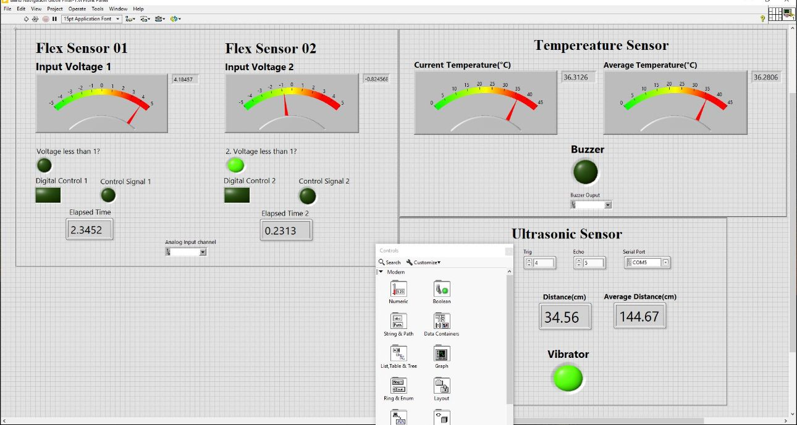
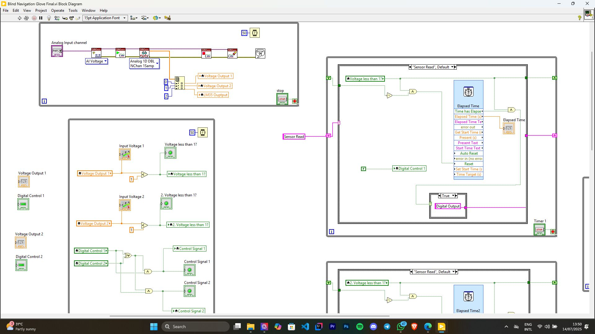
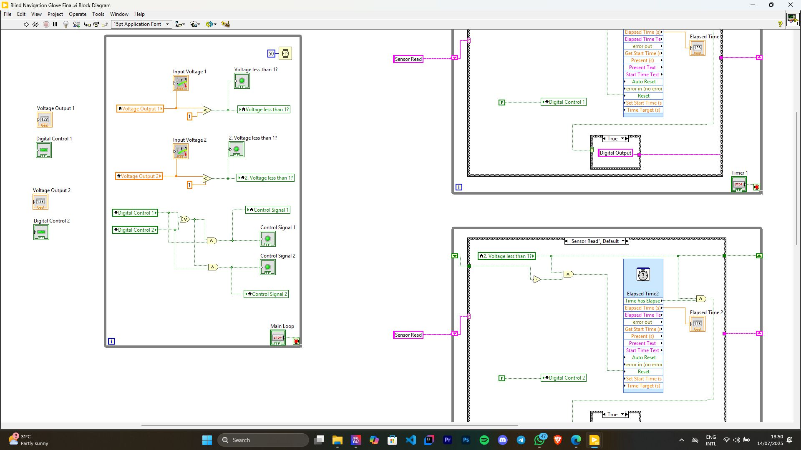
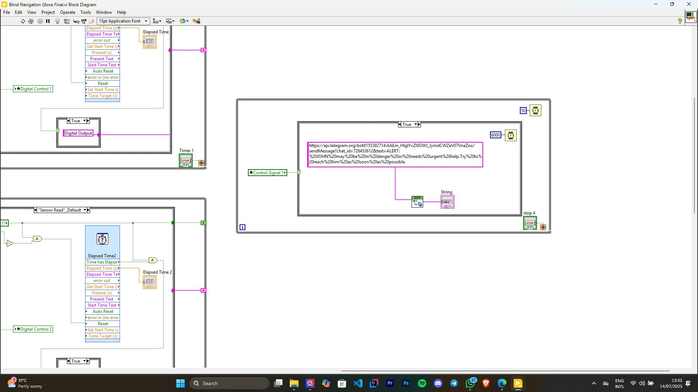
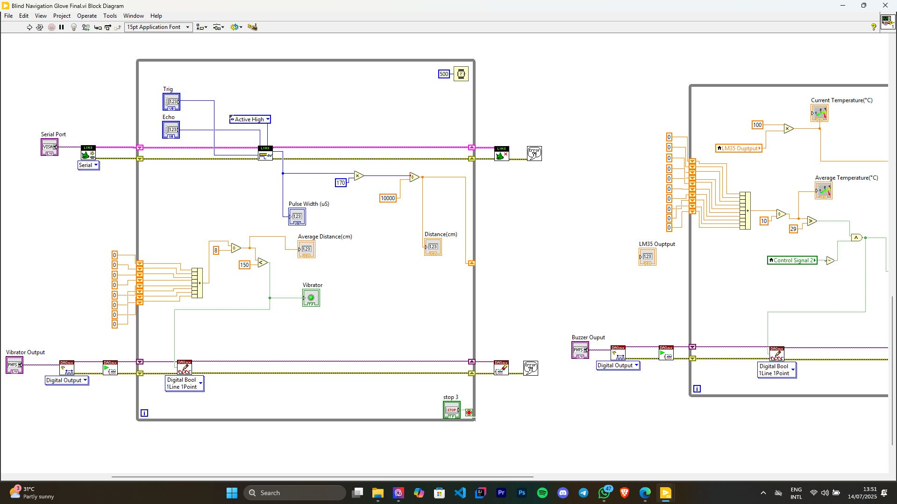
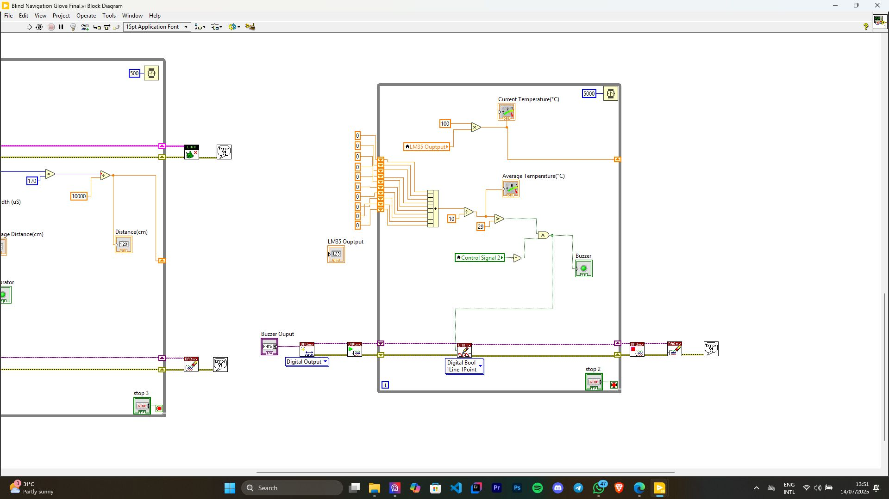
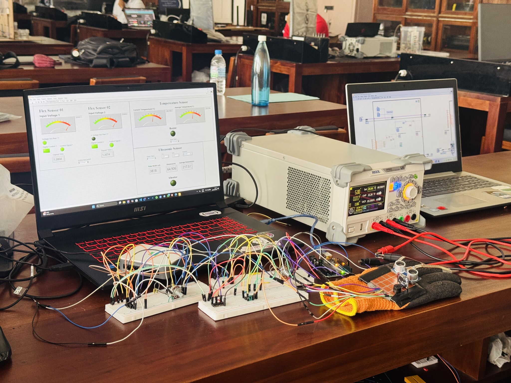
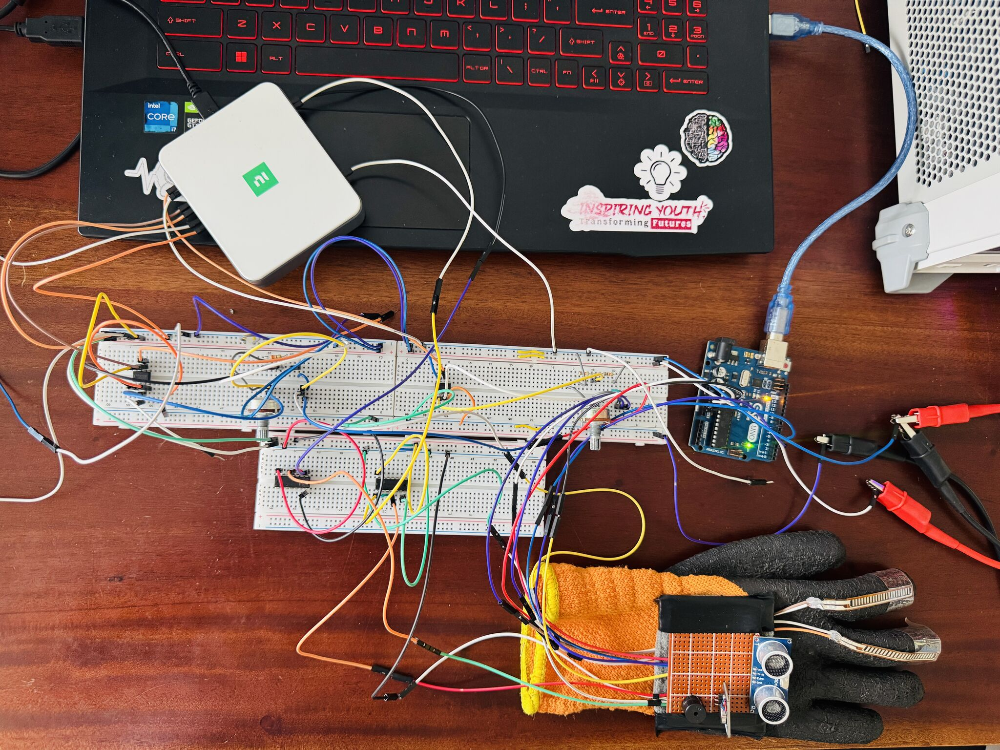

# Personalized Blind Navigation Glove 🎯

A smart wearable glove designed to assist visually impaired individuals by combining real-time sensing, data processing, and intuitive actuation for obstacle detection, body monitoring, and gesture-controlled interactions.

---

## Table of Contents
- [Overview](#overview)
- [Features](#features)
- [Hardware](#hardware)
- [Software](#software)
- [How It Works](#how-it-works)
- [Simulation & Photos](#simulation--photos)
- [Project Demonstration](#project-demonstration)
- [LinkedIn Post](#linkedin-post)
- [License](#license)

---

## Overview
This project is an innovative assistive technology solution aimed at improving navigation and safety for visually impaired users. The glove integrates multiple sensors, real-time data acquisition, and intelligent control logic to deliver smooth, intuitive feedback to the user.

It strengthens skills in sensor integration, signal processing, hardware-software integration, and user-centered design, demonstrating the real-world impact of inclusive engineering.

---

## Features

### 🔹 Obstacle Detection
- Uses an **Ultrasonic Sensor** to measure distance every 500 ms.
- Maintains an **8-sample moving average (4 seconds)** to eliminate false triggers.
- **Vibration feedback** is activated if the average distance is less than 1.5 meters.
- Smooth response designed for dynamic environments.

### 🌡️ Body Temperature Monitoring
- Monitors temperature using **LM35 Sensor** every 5 seconds.
- Maintains a **10-value moving average (50 seconds)** for stability.
- **Buzzer alert** triggers if temperature drops below normal levels for early detection of health issues.

### 🖐️ Gesture-Controlled Interaction
- Two **custom flex sensors** on fingers.
- **Middle finger bent for 3 seconds** turns off the buzzer.
- **Index finger bent for 3 seconds** sends a Telegram alert to a guardian.
- Logic prevents simultaneous gestures from causing misfires.

---

## Hardware
- **NI DAQ Card** for real-time data acquisition  
- **Ultrasonic Sensor** for obstacle detection  
- **LM35 Sensor** for body temperature monitoring  
- **Flex Sensors** for gesture detection  

---

## Software
- **LabVIEW** for signal processing, control logic, and UI design  
- Modular logic implemented with timing control, thresholding, and state management  

---

## How It Works
1. Sensors continuously monitor distance, body temperature, and finger gestures.  
2. Data is processed in LabVIEW with real-time control logic.  
3. Vibrations and buzzer alerts are triggered based on threshold conditions.  
4. Gesture-based commands allow the user to interact with the glove without physical switches.  
5. Optional Telegram alerts notify guardians in case of emergencies.  

---

## Simulation & Photos

### 🖥️ Simulation Screenshots

  
  

  
  

  
  

### 📸 Real Project Photos

  
  

---

## Project Demonstration
🎥 Watch the live demonstration of the **Personalized Blind Navigation Glove** on YouTube:  
[▶️ Watch on YouTube](https://www.youtube.com/shorts/XiqoMna9mds)

---

## LinkedIn Post
Check out the detailed project post on LinkedIn:  
[🔗 View LinkedIn Post](https://www.linkedin.com/posts/changeethan-sujinthan-7069a7327_engineeringdesign-ni-labview-activity-7350440654209970176-AA37/?utm_source=share&utm_medium=member_desktop&rcm=ACoAAFKM-TYBrXIQFI68jIaOuLNjWe2w_v7oyLg)

---

## License
This project is licensed under the MIT License. See the LICENSE file for details.
